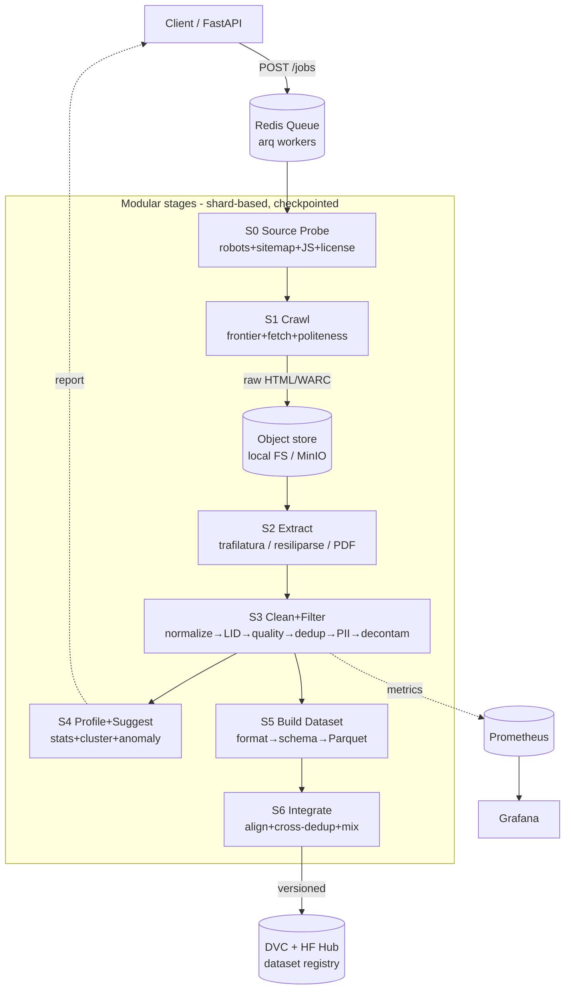

# Data Curation Service — Crawl → Clean → Build → Integrate

Reference architecture cho **service** dựng dataset fine-tuning (SFT/instruction-tuning) đa ngữ (VN + EN/multilingual), scale-on-demand. Chạy được trên **RTX 4090 24GB local + A100 80GB burst (Vast.ai)**.

Marker nguồn: `[src]` = có nguồn trực tiếp · `[2nd]` = suy ra từ nguồn/recall · `[guess]` = ước lượng/opinion, chưa xác minh.

---

## 0. Design principles (không negotiable)

| Nguyên tắc | Cụ thể hóa trong service |
|---|---|
| **Fail-closed** | Mỗi stage: record không pass validation → **drop + log lý do**, không "để tạm rồi sửa sau". Verifier lỗi (exception) → coi như FAIL, không PASS. |
| **Reproducibility** | `global_seed` trong config, set cho mọi bước có randomness (sampling, shuffle, MinHash seed, kmeans init). Artifact ghi kèm `config_hash + seed + code_git_sha + tool_versions`. |
| **Checkpointing per-stage** | Mỗi stage đọc input shards, ghi output shards + `_SUCCESS` marker + `manifest.json`. Rerun bỏ qua shard đã có `_SUCCESS` (idempotent). |
| **Config as single source of truth** | 1 file YAML (Pydantic `BaseSettings` validate). Không hardcode threshold/model literal trong code. |
| **Provenance per-record** | Mỗi record mang `source_url, crawl_ts, license, extractor, pipeline_version, filters_passed[]`. Không có → không vào dataset. |
| **Observability baked-in** | Prometheus counter per-stage (in/out/dropped + drop_reason label), Grafana dashboard, structured log (structlog JSON). Langfuse **chỉ** khi có bước LLM-in-loop (judge/synthetic). |
| **Streaming, not load-all** | Xử lý theo shard/generator, không `load_dataset(...).to_list()`. HF `datasets` streaming / `pyarrow` batched / `datatrove` shard-based. |

---

## 1. Reference architecture (data flow)



**Storage tiers:** `raw/` (HTML/WARC, immutable) → `extracted/` (JSONL text+meta) → `clean/` (JSONL post-filter) → `dataset/` (Parquet/Arrow, versioned). Mỗi tier là input immutable của tier sau → replay được từ bất kỳ điểm nào.

**Service layer (FastAPI + arq):**
```
POST /jobs/crawl        {seeds[], depth, render:auto|http|browser, lang_allow[]}  -> job_id
GET  /jobs/{id}         -> {stage, shards_done, in/out/dropped, eta}
POST /datasets/build    {clean_path, format:sharegpt|chatml|alpaca, schema_ver}   -> dataset_id
POST /datasets/{id}/integrate  {base_dataset, mix_ratios, dedup:cross}            -> new_version
GET  /datasets/{id}/profile    -> stats + suggestions
```
Queue: **arq** (async-native, nhẹ, hợp FastAPI) `[guess]`. Alt: Celery (nặng hơn, ecosystem lớn) — dùng khi cần retry/routing phức tạp. Không dùng: chạy pipeline trực tiếp trong request handler (block, không resume).

---

## 2. Stage 0 — Source analysis (probe trước khi crawl)

Bắt buộc chạy trước S1. Output: `source_profile.json` quyết định cách crawl.

| Kiểm tra | Cách làm | Quyết định nó điều khiển |
|---|---|---|
| **robots.txt** | `urllib.robotparser` / `protego` | Cho phép path? Crawl-delay? → politeness |
| **sitemap.xml** | Parse sitemap index → URL list | Seed frontier trực tiếp (khỏi crawl mù) |
| **JS-rendering?** | Fetch HTTP → so text length raw vs. cần render. Heuristic: DOM có `<div id=root>` rỗng + nhiều `<script>` → cần browser | `render: http` vs `browser` |
| **API sẵn có?** | Check `/api`, `/graphql`, RSS/Atom feed, `application/ld+json` | Ưu tiên API/feed > scrape HTML (ổn định hơn, ít vỡ) |
| **Content-type** | HTTP HEAD `Content-Type` | HTML / PDF / JSON → route đúng extractor |
| **Rate signal** | 429/503 + `Retry-After` header | Backoff config |
| **License** | Footer, `/terms`, `<meta>`, CC tags, `ai.txt`/`llms.txt` | **Gate pháp lý** (xem dưới) |

**Legal/ethical gate (fail-closed):**
- Tôn trọng `robots.txt` + `Crawl-delay`. Đây là chuẩn tối thiểu, **không** đảm bảo hợp pháp `[guess]`.
- License training-data: chỉ đưa vào dataset nội dung có license rõ (CC-BY/CC0/public domain/ODC-By) hoặc bạn có quyền. Robots cho crawl ≠ cho redistribute/train `[guess]`.
- PII/GDPR: scrub PII **trước** khi lưu clean (§4). Không lưu raw PII lâu hơn cần.
- Ghi `license` per-record ngay từ S0/S2. Record không xác định license → tag `license:unknown`, **loại khỏi** dataset công bố, chỉ giữ ở tier raw để audit.

> Đây là kỹ thuật, không phải tư vấn pháp lý. Với dataset định publish/train thương mại, kiểm tra ToS từng nguồn.

---

## 3. Stage 1 — Crawl-on-demand

### 3.1 Chọn framework

| Tool | Loại | Khi dùng | Khi KHÔNG | Failure mode |
|---|---|---|---|---|
| **Scrapy** | Async framework (Python) | Crawl diện rộng, nhiều domain, cần pipeline/middleware, resumable (JOBDIR) | Site JS-heavy (cần plugin) | Middleware phức tạp; học cong |
| **httpx + selectolax** | HTTP client + fast parser | Site tĩnh, biết trước URL, tối đa throughput/RAM | Cần JS render | Không xử lý JS; tự lo concurrency |
| **Playwright** | Headless browser | JS-heavy (SPA, lazy-load, login) | Site tĩnh (10–50× chậm + RAM) `[2nd]` | RAM/CPU cao, dễ bị anti-bot detect |
| **Crawlee (Python)** | Framework, HTTP+browser unified | Muốn 1 API auto-fallback HTTP↔browser, có sẵn queue/dedup/proxy | Job siêu nhỏ (overkill) | Ecosystem trẻ hơn Scrapy `[guess]` |
| **trafilatura (built-in crawl)** | Crawl+extract nhẹ | Crawl 1 domain lấy text nhanh, không cần JS | Diện rộng, cần control chi tiết | Crawl control tối giản |
| **Firecrawl** | Service/API (self-host được) | Muốn "URL → clean markdown" nhanh, có API | Muốn full control, tránh dependency service | Self-host nặng; hosted tốn phí `[guess]` |
| **katana** | Fast crawler (Go) | Discovery URL nhanh, diện rộng | Cần extract nội dung luôn | Chỉ crawl, extract riêng |

**Khuyến nghị cho service này:**
- Default: **Scrapy** (orchestration, resumable, middleware) cho crawl có cấu trúc; **httpx+selectolax** cho fast-path tĩnh khi đã có URL list từ sitemap.
- **Playwright** chỉ bật khi S0 gắn cờ `render:browser` — tách pool worker riêng (browser worker tốn RAM, không trộn với HTTP worker).
- Extract **tách khỏi** crawl (S1 chỉ lấy raw HTML → object store; S2 extract). Lý do: replay extraction với extractor tốt hơn mà không crawl lại.

### 3.2 Static vs JS decision

```
S0.render == "http"  → httpx/Scrapy (async, cheap)
S0.render == "browser" → Playwright pool (block_resources: image/font/media để tiết kiệm)
S0.render == "auto"  → thử HTTP; nếu text_len < threshold hoặc DOM rỗng → escalate browser
```

### 3.3 Orchestration

| Thành phần | Cách làm | Ghi chú |
|---|---|---|
| **URL frontier** | Redis sorted-set (priority) hoặc Scrapy scheduler | Priority theo depth/domain |
| **URL dedup** | **Bloom filter** (redisbloom / `pybloom`) — check "đã thấy URL?" O(1), RAM thấp | False-positive nhỏ → bỏ sót vài URL, chấp nhận được `[2nd]`. Cần chính xác 100% → set/DB |
| **Politeness** | Per-domain `Crawl-delay`, token-bucket rate limit, concurrency cap per host | Tránh DDoS vô tình + bị block |
| **Retry/backoff** | Exponential backoff + jitter; tôn trọng `Retry-After`; max_retries rồi dead-letter | 429/503 → backoff; 4xx khác → drop |
| **Proxy rotation** | Chỉ khi cần + hợp ToS. Pool + health-check | Anti-bot: cân nhắc pháp lý trước |
| **Resumability** | Scrapy `JOBDIR`, hoặc frontier trong Redis + shard `_SUCCESS` | Kill giữa chừng → resume |

---

## 4. Stage 2 — Content extraction

### 4.1 HTML → text

Benchmark (ScrapingHub article set, 181 pages) `[src]`:

| Extractor | F1 | Đặc điểm | Dùng khi |
|---|---|---|---|
| **rs-trafilatura** (Rust) | 0.859 (WCXB multi-type), ~0.967 article | Nhanh nhất (~44ms/page) + precision cao | Production scale, cần tốc độ `[src]` |
| **trafilatura** (Python) | 0.924 (ScrapingHub article) `[src]` | Balance precision/recall, giữ structure (md/xml), có metadata+date | **Default** — dùng bởi RefinedWeb, FineWeb `[src]` |
| **Resiliparse** | 0.797–0.817 | Recall cao, nhanh, nhưng **admit 2–3× boilerplate** `[src]` | Dùng bởi Dolma, DCLM; khi ưu tiên recall/tốc độ `[src]` |
| **Readability** | ~cao, ổn định | Robust nhiều loại page | Fallback |
| Neural (ReaderLM-v2, MinerU-HTML) | 0.741–0.827 | **Thua heuristic** trên article, chậm (cần GPU) `[src]` | Structured elements (table/formula/code) — không cho article thường |

**Quyết định:** default **trafilatura** (Python, có metadata + date + license hint). Scale lớn → **rs-trafilatura**. Neural: bỏ, trừ khi cần bảo toàn table/công thức (paper/PDF-like HTML) `[src]`. Convergence trên article đã đạt trần → chọn theo tốc độ/precision, không theo "neural = tốt hơn" `[src]`.

### 4.2 PDF / tài liệu học thuật

| Nhu cầu | Tool | Ghi chú |
|---|---|---|
| PDF text thường | `pymupdf` (fitz) | Nhanh, ổn |
| PDF scan (ảnh) | OCR: `tesseract` / `docTR` / PaddleOCR | VN cần OCR có tiếng Việt |
| PDF khoa học (layout, công thức, table) | **MinerU** / `marker` / GROBID (metadata) | Bảo toàn cấu trúc; MinerU tốt cho STEM `[guess]` |
| HTML có công thức/table | MinerU-HTML | Khi trafilatura làm hỏng table `[src]` |

---

## 5. Stage 3 — Clean + quality filter (core)

**Thứ tự pipeline** (theo FineWeb, đã ablate từng bước có ích) `[src]`:

```
URL filter (blocklist NSFW/malicious)
  → Extract (S2)
  → Language ID + filter
  → Gopher repetition filter
  → Gopher quality filter
  → C4 filters (chọn lọc)
  → FineWeb custom filters
  → MinHash dedup (per-crawl/per-source)
  → PII removal
  → Decontamination
```
FineWeb thứ tự thực tế: URL→Trafilatura→FastText LID (en<0.65 loại)→Gopher→C4→FineWeb custom→MinHash per-crawl→PII `[src]`. FineWeb-2 (đa ngữ): GlotLID→lọc theo language score→**dedup per-language**→filter per-language→PII+ftfy `[src]`.

### 5.1 Normalization
- Unicode **NFC** (tiếng Việt: dấu phải chuẩn hóa NFC — cùng chữ có thể có nhiều dạng Unicode, hỏng dedup nếu không normalize) `[2nd]`.
- `ftfy.fix_text()` sửa mojibake/encoding `[src]` (FineWeb dùng ftfy ở finishing).
- Chuẩn whitespace, control chars, zero-width.

### 5.2 Language ID

| Tool | Coverage | Dùng khi |
|---|---|---|
| **GlotLID-M v3.0** | 2000+ labels (Apr 2024) `[src]` | **Đa ngữ + low-resource** — chọn cho service này `[src]` |
| fastText lid.176 | 176 lang | VN/EN thường là đủ, nhanh |
| CLD3 | ~100 | Thua GlotLID trên low-resource (F1/FPR) `[src]` |

VN là medium-resource → fastText đủ, nhưng dùng **GlotLID** để đồng nhất pipeline đa ngữ + tách VN khỏi ngôn ngữ gần. Filter theo **language score threshold** (FineWeb: en < 0.65 → loại) `[src]`. VN đặt ngưỡng riêng, tune trên sample.

### 5.3 Quality filters — tường minh

**Gopher quality** (datatrove `GopherQualityFilter` defaults) `[2nd]`:
| Rule | Ngưỡng |
|---|---|
| Word count | 50 – 100,000 |
| Mean word length | 3 – 10 chars |
| Symbol/word ratio (`#`, `…`) | < 0.1 |
| Lines bắt đầu bằng bullet | < 90% |
| Lines kết thúc bằng `…` | < 30% |
| Words có ≥1 ký tự alpha | ≥ 80% |
| Stop words {the,be,to,of,and,that,have,with} | ≥ 2 xuất hiện |

> **VN cần chỉnh:** stop-word set English **vô nghĩa với tiếng Việt** → thay bằng stop-word VN (và, là, của, có, được, cho, những, một...) hoặc bỏ rule này cho VN. Mean-word-length 3–10 giả định tiếng có space-tokenization như English; tiếng Việt tách âm tiết → word ngắn hơn, cần re-tune. **Không** áp thẳng ngưỡng English cho VN `[guess]`.

**Gopher repetition** (`GopherRepetitionFilter` defaults) `[2nd]`:
`dup_line_frac<0.30, dup_para_frac<0.30, dup_line_char_frac<0.20, dup_para_char_frac<0.20`, top 2/3/4-gram char frac `<0.20/0.18/0.16`, dup 5–10-gram char frac `<0.15…0.10`.

**C4 filters** (chọn lọc — FineWeb chỉ lấy vài cái) `[src]`:
- Drop line không có terminal punctuation.
- Drop line chứa "javascript".
- Drop doc chứa "lorem ipsum" hoặc `{` (curly bracket).
- Drop line "terms-of-use"/"cookie policy".
- Drop doc quá ngắn.
- (FineWeb bỏ "curly bracket" filter vì hại HellaSwag; giữ terminal-punctuation) `[src]`.

**FineWeb custom** `[src]`: loại list-like docs, docs có repeated lines, docs sai line-formatting.

**Quality classifier (tùy chọn, nâng chất):**
- FineWeb-Edu style: classifier chấm "educational value" → filter theo score. Cần train/dùng classifier có sẵn.
- Chạy inference trên **4090** (small BERT) hoặc fastText (CPU). VN: cần classifier VN hoặc multilingual, đừng dùng English-only.
- Multilingual có sẵn: **FineWeb2-HQ classifiers** (`epfml/FineWeb-HQ-Classifiers`, apache-2.0) — mean-pooled XLM-RoBERTa-base embeddings → MLP head per-language (21 ngôn ngữ, có `vie_Latn` + `eng_Latn`), sigmoid score; chọn top 10% FineWeb/FineWeb-2 `[src]` (arXiv 2502.10361). Đây là backend `transformer` của `clean.quality` — mỗi lang trong `lang_allow` phải có head trong `lang_heads` (fail-closed).

### 5.4 Deduplication — params từ các project

| Project | n-gram | #hash | Bands×rows | Ngưỡng ~ | Scope |
|---|---|---|---|---|---|
| **FineWeb** | 5-gram (word) | 112 | 14×8 | 0.75→77%, 0.8→92% `[src]` | **per-crawl** (tốt hơn global qua ablation) `[src]` |
| **NeMo Curator** fuzzy | — | 260 | 20 buckets | — `[src]` | GPU (RAPIDS), cần A100 |
| **Zyda-2** | 25-gram (char) | 128 | 8 bands | ~85% Jaccard `[src]` | **cross-dataset** + ranking priority |

LSH threshold ≈ `(1/b)^(1/r)` `[2nd]`. FineWeb 14×8 → ~0.72, khớp curve.

**Stack dedup theo scale (solo):**
```
Exact dup      → hash (sha256) doc text. Rẻ nhất, chạy đầu.
Near-dup       → MinHash+LSH:
                 - <vài chục GB / CPU: datatrove MinhashDedup* hoặc datasketch MinHashLSH
                 - TB-scale / GPU:      NeMo Curator FuzzyDuplicates (A100 burst)
Semantic dup   → embed (BGE-M3, 4090) → ANN (Qdrant/faiss) → cosine>thresh
                 hoặc NeMo SemDedup (embed→kmeans→pairwise, GPU)
```
- **datatrove** = chính (CPU, chạy local, chính là pipeline FineWeb, có sẵn MinHash + mọi filter trên) `[src]`. Khuyến nghị làm backbone.
- **NeMo Curator** = khi cần GPU dedup scale lớn (fuzzy/semantic **bắt buộc GPU**) → dồn vào A100 burst `[src]`.
- Semantic dedup **đắt**, chỉ chạy sau near-dup, trên tập đã nhỏ. BGE-M3 embed trên 4090 ổn.

### 5.5 PII scrubbing
- **Presidio** (analyzer + anonymizer, NER-based) — email, phone, IP, person, location `[2nd]`. NeMo có `PIIRedactor` (replace/redact) `[src]`.
- FineWeb tối thiểu: anonymize email + public IP `[src]`.
- VN: PII patterns khác (CMND/CCCD 9–12 số, SĐT +84...) → thêm regex riêng, đừng chỉ dựa NER English.
- Chiều ngược lại cũng cấm: NER English áp lên text tiếng Việt → false-positive tràn lan (từ thường bị redact thành PERSON/LOCATION, phá nát text). Presidio chỉ chạy cho doc thuộc `presidio_langs` (mặc định `[en]`); doc VN dùng VN regex `[2nd]`.
- Fail-closed: regex high-recall cho định danh nhạy cảm; NER cho phần còn lại.

### 5.6 Decontamination
- Loại doc trùng/gần-trùng với **test set benchmark** (MMLU, AIME, MATH-500, MGSM, HumanEval...) để không leak vào train.
- Cách: n-gram overlap (13-gram substring match kiểu GPT-3 `[2nd]`) hoặc MinHash giữa corpus và test set.
- Bắt buộc nếu định publish + báo cáo benchmark (đúng "submission hygiene").

---

## 6. Stage 4 — Pattern discovery + suggestions

Map "tìm đặc trưng và gợi ý". Output: `profile_report.json` + gợi ý keep/filter.

| Bước | Kỹ thuật | Ra cái gì |
|---|---|---|
| **Distribution profiling** | Histogram: doc length, lang, quality score, symbol ratio, domain, license, ppl | Phát hiện skew (1 domain chiếm 80%?) |
| **Anomaly detection** | Outlier trên length/repetition/ppl; near-empty; template-spam | List doc/pattern nghi ngờ |
| **Clustering / topic** | Embed (BGE-M3) → UMAP → HDBSCAN, hoặc BERTopic | Cụm chủ đề → biết corpus phủ gì, thiếu gì |
| **Dedup rate audit** | % removed từng stage | Nguồn nào rác nhiều → chỉnh crawl |
| **Suggestion engine** | Rule trên stats: "domain X 90% low-quality → blocklist"; "cluster Y toàn boilerplate → drop"; "lang Z score thấp → tune threshold" | Đề xuất actionable, người duyệt |

Profiling **trước** khi build → quyết định mix ratio (§8) dựa dữ liệu, không đoán.

---

## 7. Stage 5 — Build dataset (fine-tuning format)

### 7.1 Format cho SFT

| Format | Cấu trúc | Dùng khi |
|---|---|---|
| **OpenAI messages / ChatML** | `messages:[{role,content}]` (system/user/assistant) | **Default** — chat/instruction, hầu hết trainer (axolotl, TRL) support `[2nd]` |
| **ShareGPT** | `conversations:[{from:human/gpt, value}]` | Multi-turn; nhiều tool convert được `[2nd]` |
| **Alpaca** | `{instruction, input, output}` | Single-turn instruction đơn giản `[2nd]` |

Lưu **JSONL** (1 record/dòng, stream được) → convert **Parquet/Arrow** cho HF `datasets` (columnar, memory-map, nhanh) `[2nd]`.

**Synthetic QA (Phase B):** bật `build.synth` → S5 dùng LLM local (connection block `agent`, §14) sinh `questions_per_doc` cặp hỏi-đáp per clean doc — cùng ngôn ngữ với nguồn, câu trả lời chỉ dựa trên text nguồn (không bịa). Record mang `synthetic: true` + `synth_model` trong provenance, giữ nguyên `source_url`/`license` gốc; **license gate chạy TRƯỚC khi sinh** (không tốn inference cho doc unpublishable). LLM trả JSON hỏng → retry có phản hồi lỗi rồi drop `synth_failed` (fail-visible, không chặn cả run) `[guess]`. LLM-in-loop → điểm gắn Langfuse tracing (§9.4).

Ví dụ record (ChatML-style JSONL):
```json
{"messages":[{"role":"system","content":"..."},{"role":"user","content":"..."},{"role":"assistant","content":"..."}],
 "meta":{"source_url":"...","license":"CC-BY","lang":"vi","quality":0.82,"pipeline_version":"1.3.0","filters_passed":["gopher","c4","minhash"]}}
```

### 7.2 Schema + provenance (Pydantic — typed artifact)
```python
class Provenance(BaseModel):
    source_url: str
    crawl_ts: datetime
    license: Literal["cc-by","cc-by-sa","cc0","public-domain","odc-by","unknown"]
    extractor: str            # "trafilatura-2.1.0"
    pipeline_version: str
    seed: int
    filters_passed: list[str]
    synthetic: bool = False   # §7.1 Phase B — record do LLM sinh từ source
    synth_model: str | None   # model đã sinh (vd gemma4:e4b)

class SFTRecord(BaseModel):
    id: str                   # stable ID (hash text) cho dedup/versioning
    messages: list[Message]
    lang: str                 # GlotLID label
    quality: float | None
    prov: Provenance
```
Stable `id` bắt buộc — mọi dedup/removal workflow cần document ID ổn định `[src]` (NeMo yêu cầu `AddId` đầu pipeline).

### 7.3 Versioning + lineage

| Tool | Vai trò | Khi dùng |
|---|---|---|
| **DVC** | Version data + pipeline stages (`dvc.yaml`), lineage, repro `dvc repro` | **Chính** — git-native, hợp solo, tie code↔data `[guess]` |
| **HuggingFace Hub** | Host/share dataset, viewer, revision | Publish + collaborate |
| git-lfs | Blob lớn trong git | Nhỏ; DVC tốt hơn cho pipeline |
| lakeFS / Delta Lake | Data lake versioning | Overkill cho solo `[guess]` |

`dvc.yaml` khai báo từng stage (deps, outs, params) → đổi param/seed → `dvc repro` chạy lại đúng phần ảnh hưởng, ghi lineage. Đây là "reproducibility as hard gate".

---

## 8. Stage 6 — Integrate với dataset hiện có

### 8.1 Schema alignment
- Chuẩn hóa mọi nguồn về **1 schema** (§7.2) trước khi trộn. Map field, normalize format (ShareGPT→ChatML...), ép provenance.
- Record thiếu field bắt buộc → fail-closed (loại hoặc backfill có log).

### 8.2 Cross-dataset dedup (pattern Zyda-2) `[src]`
```
1. Gộp corpus mới + dataset cũ, gán ID ổn định.
2. MinHash+LSH toàn bộ → build graph (node=doc, edge=near-dup) → connected components.
3. Mỗi cluster giữ 1 doc theo RANKING PRIORITY nguồn.
   Zyda-2: FineWeb-Edu2 > DCLM > Zyda-1 > Dolma-CC (giữ doc từ nguồn hạng cao) [src].
   Bạn: định thứ hạng ưu tiên (vd curated-cũ > crawl-mới) → giữ bản chất lượng cao.
```
Zyda-2 cross-dedup loại ~11% token / ~13% doc so với các phần rời `[src]` → kỳ vọng overlap đáng kể khi trộn. NeMo `RankingStrategy` / `RankingStrategy` metadata-based làm sẵn việc "giữ doc nguồn ưu tiên" `[src]`.

### 8.3 Mixing / balancing cho fine-tuning
| Chiến lược | Cách |
|---|---|
| **Domain mixing** | Đặt tỉ lệ theo mục tiêu (code/chat/QA...). Dùng profile §6 để biết phân bố hiện có |
| **Language balancing** | VN low-resource dễ bị English lấn → **upsample VN** / downsample EN. Cân theo token, không theo #doc |
| **Quality upsampling** | Upsample tập high-quality (edu score cao), downsample rác đã lọt |
| **Dedup trước mix** | Cross-dedup **trước** khi tính ratio (tránh đếm trùng) |

Ghi `mix_manifest.json`: nguồn → #token → ratio → seed. Reproducible.

---

## 9. Optimization + standardization

### 9.1 Performance
| Vấn đề | Giải pháp |
|---|---|
| I/O + parse chậm | Async (httpx/Scrapy), `selectolax`/`lxml` thay BeautifulSoup (nhanh hơn nhiều) `[2nd]` |
| RAM | Shard-based streaming, `pyarrow` batched, HF `datasets` memory-map; **không** load-all |
| CPU parallelism | datatrove multiprocessing per-shard; `multiprocessing`/`ray` cho filter |
| Dedup scale | MinHash CPU (datatrove) đủ tới ~chục GB; TB → NeMo GPU (A100) `[src]` |
| GPU tận dụng | 4090: embed (BGE-M3), classifier inference, semantic dedup vừa. A100 burst: NeMo fuzzy/semantic dedup scale lớn |
| Browser render đắt | Pool riêng, block image/font/media, tái dùng context, cap concurrency |

### 9.2 Ước lượng tài nguyên `[guess]`
- **4090 24GB:** BGE-M3 embed batch lớn OK; small quality-classifier OK; semantic dedup tới ~vài triệu doc (qua Qdrant/faiss). Không đủ cho NeMo fuzzy dedup TB-scale.
- **A100 80GB burst:** NeMo Curator fuzzy/semantic dedup (RAPIDS cần GPU) — dồn job dedup lớn vào đây rồi tắt. NeMo: dedup 1.96T token / 0.5h / 32×H100 (RedPajama-V2) `[src]` → 1 A100 nhỏ hơn nhiều nhưng đủ cho scale solo.
- **Crawl/extract/filter:** CPU-bound → chạy local, không cần GPU.

### 9.3 Config as single source of truth (sketch)
```yaml
global:
  seed: 42
  pipeline_version: "1.3.0"
crawl:
  render: auto            # auto|http|browser
  render_min_text_len: 200  # auto: text < threshold → escalate browser (§3.2)
  max_depth: 3
  per_host_concurrency: 4
  respect_robots: true
  politeness_delay: 1.0   # giây giữa 2 request cùng host; robots Crawl-delay ghi đè (§3)
  url_exclude: []         # regex loại URL non-article khỏi frontier (§3.3)
extract:
  primary: trafilatura    # trafilatura|resiliparse|rs-trafilatura
  fallback: readability
clean:
  lang_id: glotlid        # glotlid|fasttext
  lang_allow: [vi, en]
  lang_score_min: {vi: 0.60, en: 0.65}
  gopher_quality: {min_words: 50, max_words: 100000, ...}
  vi_overrides: {use_vi_stopwords: true, disable_word_len_rule: true}
  minhash: {ngram: 5, num_hashes: 112, bands: 14, rows: 8, scope: per_source}
  pii: {backend: presidio, vi_regex: true, presidio_langs: [en]}
  decontam: {benchmarks: [mmlu, aime, math500, mgsm], ngram: 13}
  quality: {enabled: false, backend: fasttext, model_path: null, positive_label: __label__hq, min_score: 0.5, embed_model: FacebookAI/xlm-roberta-base, lang_heads: {vi: vie_Latn.pt, en: eng_Latn.pt}}  # §5.3 (P1); backend fasttext|transformer
profile:
  cluster: {enabled: false, embed_model: BAAI/bge-m3, max_docs: 2000, min_cluster_size: 5}  # §6 (P1)
build:
  format: chatml
  synth: {enabled: false, questions_per_doc: 2, max_chars: 4000}  # §7.1 Phase B — LLM local (agent.*) sinh QA
integrate:
  cross_dedup: true
  source_priority: [curated_v2, crawl_new]   # giữ doc nguồn hạng cao
  mix_ratios: {vi: 0.5, en: 0.5}             # theo token
service:
  redis_url: redis://localhost:6379          # arq queue (§1)
  max_jobs: 4
agent:                                       # §14 — intake agent (extension)
  base_url: http://localhost:11434/v1        # OpenAI-compatible (Ollama/llama.cpp)
  model: gemma4:e4b                          # nâng cấp: hf.co/unsloth/gemma-4-26B-A4B-it-qat-GGUF:Q4_K_M
  temperature: 0.2
  timeout_s: 120
  max_rounds: 3                              # số vòng agent hỏi lại user
```

### 9.4 Observability
- Prometheus: `stage_records_total{stage,status}` (in/out/dropped), `drop_reason_total{stage,reason}`, `stage_duration_seconds`.
- Grafana: funnel per-stage (thấy stage nào loại nhiều, drift).
- structlog JSON: mỗi drop ghi `{doc_id, stage, reason}`.
- Langfuse: **chỉ** khi có LLM-in-loop (LLM quality judge / synthetic gen) — trace prompt/score. Không có LLM step thì không cần.

---

## 10. Tool stack — tổng hợp (mapped to hardware)

| Layer | Tool chính | Alt | Hardware |
|---|---|---|---|
| API/service | FastAPI + arq | Celery | CPU |
| Queue/frontier | Redis (+ redisbloom) | — | CPU |
| Crawl tĩnh | Scrapy / httpx+selectolax | Crawlee | CPU |
| Crawl JS | Playwright | Selenium | CPU (RAM cao) |
| Extract HTML | trafilatura → rs-trafilatura | Resiliparse | CPU |
| Extract PDF | pymupdf / MinerU | marker, GROBID | CPU (+GPU cho MinerU) |
| Pipeline backbone | **datatrove** | Data-Juicer | CPU (local) |
| GPU dedup scale | **NeMo Curator** (fuzzy/semantic) | — | **A100 burst** |
| Language ID | GlotLID-M v3 | fastText lid.176 | CPU |
| Embed / semantic dedup | BGE-M3 + Qdrant/faiss | — | **4090** |
| PII | Presidio (+VN regex) | NeMo PIIRedactor | CPU |
| Versioning | DVC + HF Hub | git-lfs | — |
| Storage | local FS / MinIO (S3) | — | Disk |
| Observability | Prometheus+Grafana, structlog, (Langfuse) | — | CPU |

---

## 11. Vietnamese-specific

- **Tokenizer coverage:** Qwen2.5/3 phủ tiếng Việt tốt hơn Llama-3 (bạn đã note) → chọn Qwen làm base fine-tune cho VN `[guess, khớp kinh nghiệm bạn]`.
- **Unicode NFC bắt buộc** — dấu tiếng Việt có nhiều dạng Unicode, không normalize → dedup/so khớp sai `[2nd]`.
- **Language ID:** VN medium-resource, fastText đủ nhưng GlotLID tách VN khỏi ngôn ngữ gần + đồng nhất pipeline `[src]`.
- **Word segmentation** (nếu cần token-level rule / phân tích): VnCoreNLP / underthesea / pyvi. Cho SFT text thường thì **không** cần segment (model tự xử lý) — chỉ cần khi rule filter dựa "từ".
- **Quality filter phải re-tune cho VN:** stop-word English vô dụng; mean-word-length giả định space-tokenization English. Thay stop-word VN, tắt/tune rule độ dài từ (§5.3).
- **Nguồn VN sẵn để seed/đối chiếu** `[src]`: CulturaX (167 lang, có vi; Nguyen et al. 2023, arXiv 2309.09400), FineWeb-2 (per-language, có vi; arXiv 2506.20920), OSCAR, VN News Corpus (~50GB), C4-vi, Wikipedia vi. Repo tổng hợp: `vndee/awsome-vietnamese-nlp`.
- **PII VN:** CCCD/CMND (9–12 số), SĐT +84 → regex riêng.

---

## 12. Phased build plan

| Phase | Làm gì | Mục tiêu |
|---|---|---|
| **P0 MVP** | S0 probe + S1 (httpx/Scrapy tĩnh) + S2 trafilatura + S3 tối thiểu (NFC+ftfy → GlotLID → Gopher+C4 → exact+MinHash dedup → Presidio) + S5 ChatML JSONL. datatrove backbone. DVC version. Seed + checkpoint + Prometheus counter. | 1 nguồn → dataset sạch, reproducible, end-to-end |
| **P1** | Playwright pool (JS), S4 profiling+suggestion, decontamination, quality classifier, VN filter overrides | Chất lượng + coverage |
| **P2** | S6 integrate (cross-dedup Zyda-2 + mix ratio), NeMo GPU dedup trên A100 cho scale lớn, semantic dedup | Scale + trộn dataset cũ |
| **P3** | FastAPI service hoàn chỉnh (job queue, status, API), **agent intake §14** (URL+nhu cầu → LLM local lập DatasetPlan), Grafana dashboard, Langfuse nếu thêm LLM-judge/synthetic | Service hóa |

Nguyên tắc: **đơn giản nhất chạy được trước** (datatrove CPU local), chỉ thêm GPU/NeMo/browser/LLM khi đo được cần.

---

## 13. Failure modes / caveats

| Rủi ro | Hệ quả | Phòng |
|---|---|---|
| Áp ngưỡng filter English cho VN | Loại oan tiếng Việt / giữ rác | VN overrides, tune trên sample VN |
| Presidio NER English chạy trên doc VN | False-positive redact từ thường → phá nát text VN | Gate theo lang: `pii.presidio_langs` (§5.5); VN dùng regex riêng (§11) |
| Bỏ NFC normalize | Dedup sót, so khớp sai | NFC trước mọi hash/dedup |
| Semantic dedup chạy sớm/toàn tập | Đắt, chậm, OOM | Chạy sau near-dup, trên tập nhỏ |
| Global dedup thay per-source | FineWeb ablate: per-crawl tốt hơn `[src]` | Dedup per-source/per-crawl |
| Không stable ID | Dedup/removal/versioning vỡ | AddId đầu pipeline `[src]` |
| License unknown lọt vào publish | Rủi ro pháp lý | Gate license, unknown→loại khỏi release |
| Không decontam | Leak benchmark → số ảo | Decontam trước khi báo cáo |
| Verifier exception coi là PASS | Rác lọt (fail-open) | Fail-closed: exception=FAIL |
| Neural extractor vì "nghe xịn" | Chậm + F1 thua heuristic trên article `[src]` | trafilatura default |
| NeMo fuzzy dedup trên CPU | Không chạy (bắt buộc GPU) `[src]` | Dồn A100 burst hoặc dùng datatrove CPU |
| LLM agent tự quyết gate (robots/license/PII) | Mất fail-closed — plan "sáng tạo" lách kiểm soát | §14: plan là subset an toàn của §9.3, không có field nới gate; Pydantic validate |

---

## 14. Agent intake layer (extension — P3)

Lớp điều phối đặt TRÊN pipeline, không thay thế gate nào: user đưa `{URL + nhu cầu}` → LLM local phân tích, hỏi lại khi thiếu thông tin → `DatasetPlan` → user duyệt → pipeline deterministic chạy S1→S5.

- **Flow:** prompt `{url, need}` → S0 probe (§2) → LLM đọc source_profile + nhu cầu → sinh tiêu chí chi tiết → hỏi lại user (≤ `agent.max_rounds` vòng) → `DatasetPlan` (Pydantic) → confirm → S1 crawl → S2 extract → S3 clean → S4 profile → S5 build.
- **LLM chỉ đề xuất, không quyết định gate:** plan là subset an toàn của §9.3 (seeds/depth/max_pages/render/lang_allow/format/quality_min_score) — không tồn tại field robots/license/dedup-scope/PII; mọi gate vẫn enforce trong pipeline (xem failure mode §13).
- **Backend LLM:** model GGUF local (Gemma QAT) qua API OpenAI-compatible — một code path phủ Ollama (`/v1`), llama.cpp server, LM Studio `[2nd]`. Model 26B-A4B QAT chạy được trên máy 24GB unified memory nhưng sát RAM — đổi model nhỏ hơn chỉ là 1 key config `[guess]`.
- **Fail-closed:** LLM trả JSON sai → retry kèm phản hồi lỗi (tối đa `max_retries`), hết lượt → RuntimeError; server LLM không chạy → lỗi tường minh (CLI) / 503-502 (API). Pipeline KHÔNG phụ thuộc agent — các stage chạy độc lập như cũ.
- **Giao diện:** CLI `crawl-datasets-agent --url --need --out` (hỏi-đáp terminal, confirm trước khi chạy) + API `/agent/sessions` → `/answers` → `/execute` (enqueue `plan_job` qua arq). Session API in-memory per-process — multi-worker cần chuyển Redis `[guess]`.

---

### Nguồn chính
- FineWeb (arXiv 2406.17557) — pipeline, MinHash 5-gram/112-hash/14×8, per-crawl, C4/Gopher/custom filters `[src]`
- FineWeb-2 (arXiv 2506.20920) — per-language: GlotLID→filter→dedup `[src]`
- Zyda-2 (arXiv 2411.06068) — cross-dataset dedup + ranking priority `[src]`
- GlotLID (arXiv 2310.16248, v3.0 Apr 2024, 2000+ labels) `[src]`
- trafilatura (ACL 2021) + WCXB benchmark (arXiv 2605.21097) `[src]`
- NeMo Curator (github NVIDIA-NeMo/Curator, docs) — exact/fuzzy(MinHash+LSH)/semantic, GPU, RankingStrategy `[src]`
- CulturaX (arXiv 2309.09400, 167 lang) `[src]`
- FineWeb2-HQ (arXiv 2502.10361) — model-based data selection: XLM-R embed + classifier per-language, top 10%; weights `epfml/FineWeb-HQ-Classifiers` `[src]`
- datatrove (github huggingface/datatrove) `[src]`
